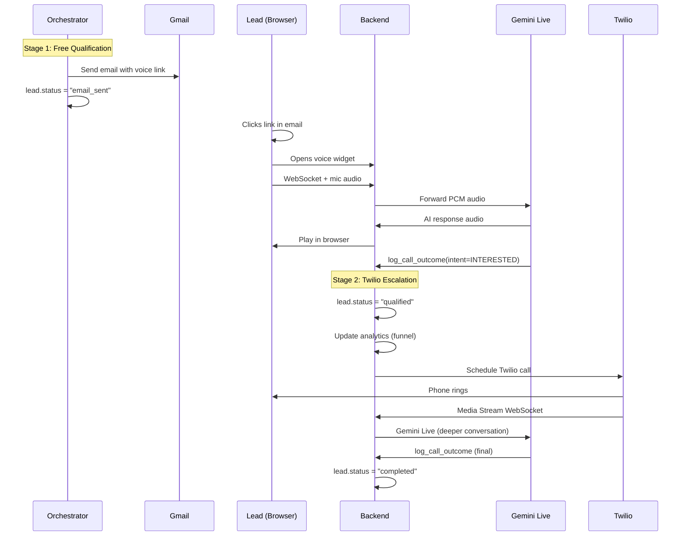

# Hybrid Voice Funnel — WebRTC Qualification + Twilio Escalation

## Goal
Build a **two-stage qualification funnel** that minimizes cost while maximizing conversion:

1. **Stage 1 (FREE)**: Email → Lead clicks link → Voice widget (WebRTC) → AI qualifies
2. **Stage 2 (PAID, only interested leads)**: AI auto-books a Twilio call → deeper conversation on the phone

**Cost model**: Instead of calling 100% of leads on Twilio (~$0.02/min each), you only call the ~15-20% who showed interest through the free widget. **5x cost reduction.**

---

## Architecture Overview



---

## Lead Status Flow (Full Funnel)

```
pending → email_sent → widget_started → qualified → call_booked → calling → completed
                                      ↘ not_interested (end)
                                      ↘ callback (schedule later)
                         ↘ email_bounced (end)
                         ↘ no_response (after 48h, end)
```

| Status | Meaning | Stage |
|--------|---------|-------|
| `pending` | Lead uploaded, not yet contacted | — |
| `email_sent` | Email dispatched via Gmail | Stage 1 |
| `widget_started` | Lead opened voice widget | Stage 1 |
| `qualified` | AI determined INTERESTED via widget | Stage 1→2 |
| `call_booked` | Twilio call scheduled/initiated | Stage 2 |
| `calling` | Twilio call in progress | Stage 2 |
| `completed` | Full funnel done | Done |
| `not_interested` | AI determined not interested | Done |
| `callback` | Lead wants to be called back later | Pending |
| `failed` | Call failed / bounced | Done |

---

## Phase 1: WebRTC Voice Widget (FREE tier)

### 1. Email Dispatch — Gmail Integration

#### [NEW] `backend/src/services/email.service.js`
- **Nodemailer** + Gmail App Password (zero OAuth complexity)
- Branded HTML email with catchy subject lines:
  - `"🎯 {business_name} has something special for you, {customer_name}!"`
  - `"⚡ Quick chat? {business_name}'s AI assistant wants to connect"`
  - `"🔥 {customer_name}, don't miss this from {business_name}"`
- Big CTA button: **"Talk to our AI Assistant →"**
- Link: `{FRONTEND_URL}/call.html?id={leadId}&t={jwt}`
- JWT token: short-lived (48h), contains leadId + campaignId, signed with AUTH_JWT_SECRET
- Rate limit: 1 email per lead per 24h
- Tracks: `email_sent_at` timestamp on lead doc

---

### 2. Lead-Facing Voice Widget

#### [NEW] `frontend/call.html` — Standalone page (not SPA)
Fast-loading, standalone HTML page. No auth required — JWT in URL validates the session.

**UX Flow:**
1. Lead opens link → sees branded page: company name, audio orb, greeting
2. Sees: *"Hi {customer_name}! {business_name}'s AI assistant is ready to chat."*
3. Clicks **"Start Conversation"** → browser requests mic permission
4. Audio orb activates → real-time voice conversation
5. AI follows campaign script, qualifies the lead
6. **If INTERESTED** → AI says: *"Great! We'll give you a call shortly to continue this conversation."*
7. Widget shows: *"Thank you! Expect a call from us soon. ✅"*
8. **If NOT_INTERESTED** → AI wraps up warmly, widget shows: *"Thanks for your time!"*

#### [NEW] `frontend/js/call-widget.js` — WebSocket audio client
- Connects to `wss://backend/voice-stream/{leadId}?t={jwt}`
- `getUserMedia({ audio: true })` → mic capture
- `AudioWorklet` processor: resamples to PCM16 16kHz → sends as base64 chunks
- Receives AI PCM16 audio → plays via `AudioContext` + `AudioBufferSourceNode`
- Provides amplitude data to audio-orb for visualization

#### [NEW] `frontend/js/audio-orb.js` — Animated audio-reactive orb
- Pure CSS + Canvas — no Three.js, no heavy models
- Glassmorphic floating orb with audio-reactive wave ripples
- States:
  - **Idle**: gentle pulse glow
  - **Listening**: ring glow intensifies, subtle particles
  - **Speaking**: wave burst, orb expands/contracts with audio amplitude
- Siri/Google Assistant aesthetic — premium, AI-native
- Loads instantly on any device

#### [NEW] `frontend/css/call-widget.css` — Voice widget styling
- Dark glassmorphic theme (matches main app)
- Responsive (works on mobile)
- Smooth transitions between states

---

### 3. Backend — WebSocket Bridge (Refactored)

#### [MODIFY] `backend/src/services/bridge.service.js`

**Add new path** `/voice-stream/:leadId` for browser clients alongside existing `/media-stream/:leadId` for Twilio:

```
Browser path:  /voice-stream/:leadId  → PCM16 direct (no μ-law)
Twilio path:   /media-stream/:leadId  → μ-law 8kHz (existing, for Stage 2)
```

**Browser-specific handling:**
- JWT validation on WebSocket upgrade
- No μ-law conversion — browser sends/receives PCM16 natively
- Update lead status to `widget_started` on connect
- On `log_call_outcome` tool call:
  - If `intent === 'INTERESTED'` → update lead to `qualified` → **trigger Twilio escalation**
  - If `intent === 'NOT_INTERESTED'` → update lead to `not_interested`
  - If `intent === 'CALLBACK'` → update lead to `callback`

**Gemini connection**: Identical to existing — same `connectToGemini()`, same tool declarations, same prompt builder.

---

### 4. Orchestrator Changes

#### [MODIFY] `backend/src/services/orchestrator.service.js`

**Stage 1 dispatch** (replaces Twilio as primary):
```js
// Before: initiateCall() → twilioClient.calls.create(...)
// After:  sendEmail() → emailService.sendCallEmail(...)
```

**Stage 2 escalation** (NEW — triggered by bridge when intent=INTERESTED):
```js
// NEW function: escalateToCall(leadId)
// 1. Fetch lead → verify status === 'qualified'
// 2. Update lead → status = 'call_booked'
// 3. twilioClient.calls.create({ to: lead.phone_number, ... })
// 4. Use same /media-stream/:leadId Twilio bridge (already exists)
```

**Poll loop changes:**
- Primary: find `pending` leads → send emails (not calls) 
- Escalation: find `qualified` leads → initiate Twilio calls
- Both run in the same poll cycle

---

### 5. Intelligent Escalation Logic

#### [NEW] `backend/src/services/escalation.service.js`

Called by `bridge.service.js` when `log_call_outcome` fires with `intent === 'INTERESTED'`:

```js
async function escalateToTwilioCall(leadId) {
  // 1. Update lead status → 'qualified' + save widget outcome
  // 2. Update campaign analytics (qualified_count++)
  // 3. Check if Twilio is configured (TWILIO_ACCOUNT_SID exists)
  //    - Yes → schedule call immediately (or with delay)
  //    - No  → mark as 'qualified', dashboard shows "Ready for manual follow-up"
  // 4. Initiate Twilio call via existing initiateCall() function
  // 5. The call uses /media-stream/:leadId → existing bridge → Gemini Live
  //    BUT with an upgraded prompt: "This is a follow-up call. The customer has
  //    already shown interest via the web assistant. Proceed to..."
}
```

#### Prompt upgrade for Stage 2 calls:
The prompt builder already fetches campaign data. For escalated calls, we add context:
```
## IMPORTANT CONTEXT
This customer ({customer_name}) has ALREADY spoken with the web assistant and expressed 
INTEREST. This is a follow-up call to close the deal. Their previous conversation summary: 
"{widget_summary}". Do NOT re-introduce the product. Jump straight to next steps.
```

---

### 6. Analytics — Funnel Tracking

#### [MODIFY] Campaign analytics to track the full funnel:

```json
{
  "campaign_id": "...",
  "funnel": {
    "total_leads": 100,
    "emails_sent": 95,
    "emails_opened": 42,
    "widget_started": 35,
    "qualified": 18,
    "calls_booked": 18,
    "calls_completed": 15,
    "not_interested": 17,
    "callbacks": 3
  },
  "conversion_rate": 15.0,
  "cost_savings": "82% vs all-Twilio approach"
}
```

#### [MODIFY] `frontend/js/pages/dashboard.js`
- Show funnel metrics in the stats grid
- New status badges: `email_sent` (blue), `widget_started` (purple), `qualified` (green), `call_booked` (teal)
- Lead table shows full journey per lead

---

## File Summary

| Action | File | Description |
|--------|------|-------------|
| **NEW** | `backend/src/services/email.service.js` | Nodemailer email dispatch |
| **NEW** | `backend/src/services/escalation.service.js` | Intelligent Twilio escalation logic |
| **NEW** | `backend/src/routes/voice.routes.js` | Voice session validation endpoint |
| **NEW** | `frontend/call.html` | Lead-facing voice widget page |
| **NEW** | `frontend/js/call-widget.js` | WebSocket audio + UI logic |
| **NEW** | `frontend/js/audio-orb.js` | Animated audio-reactive orb |
| **NEW** | `frontend/css/call-widget.css` | Voice widget styling |
| **MODIFY** | `backend/src/services/bridge.service.js` | Add `/voice-stream/` + escalation trigger |
| **MODIFY** | `backend/src/services/orchestrator.service.js` | Email-first + qualified-call dispatch |
| **MODIFY** | `backend/src/services/prompt.builder.js` | Follow-up prompt for Stage 2 calls |
| **MODIFY** | `frontend/js/pages/dashboard.js` | Funnel metrics + new statuses |
| **MODIFY** | `frontend/css/main.css` | New badge styles |
| **KEEP** | `backend/src/config/twilio.js` | Keep for Stage 2 escalation |
| **KEEP** | `backend/src/routes/twilio.routes.js` | Keep for Stage 2 media stream |
| **KEEP** | `backend/src/controllers/twilio.controller.js` | Keep for Stage 2 webhooks |
| **DELETE** | `backend/src/services/notification.service.js` | Replace SMS with email |

---

## Environment Variables

| Variable | Value | Purpose |
|----------|-------|---------|
| `GMAIL_USER` | `sharingum11@gmail.com` | Send emails |
| `GMAIL_APP_PASSWORD` | *(generate in Google Account)* | Gmail auth |
| `FRONTEND_URL` | `https://veda-frontend-...run.app` | Email links |
| `TWILIO_ACCOUNT_SID` | *(existing)* | Stage 2 calls only |
| `TWILIO_AUTH_TOKEN` | *(existing)* | Stage 2 calls only |
| `TWILIO_NUMBER` | `+15756139784` | Stage 2 caller ID |

---

## Verification Plan

### Automated Tests
- Unit test email.service.js with mocked Nodemailer
- Unit test escalation.service.js — verify it only escalates INTERESTED leads
- Integration: WebSocket connect → audio round trip → tool call → escalation trigger

### Manual Verification (Full Funnel)
1. Create campaign → upload CSV (with your email) → activate
2. Check inbox → verify catchy email arrives
3. Click link → voice widget loads with audio orb
4. Talk to AI → express interest → AI says "We'll call you"
5. Check dashboard → lead status: `qualified` → `call_booked`
6. Phone rings → Twilio call connects → AI continues with follow-up context
7. Dashboard shows full funnel analytics

---

## Decisions (Finalized)

- ✅ **Email**: Nodemailer + Gmail App Password (free, 2 env vars)
- ✅ **Avatar**: Audio-reactive glassmorphic orb (CSS+Canvas, no Three.js)
- ✅ **Twilio**: Keep as **Stage 2 escalation only** (not primary)
- ✅ **Funnel**: email_sent → widget_started → qualified → call_booked → completed
- ✅ **Cost**: ~$0 for 80% of leads (not interested), Twilio only for ~20% (interested)
